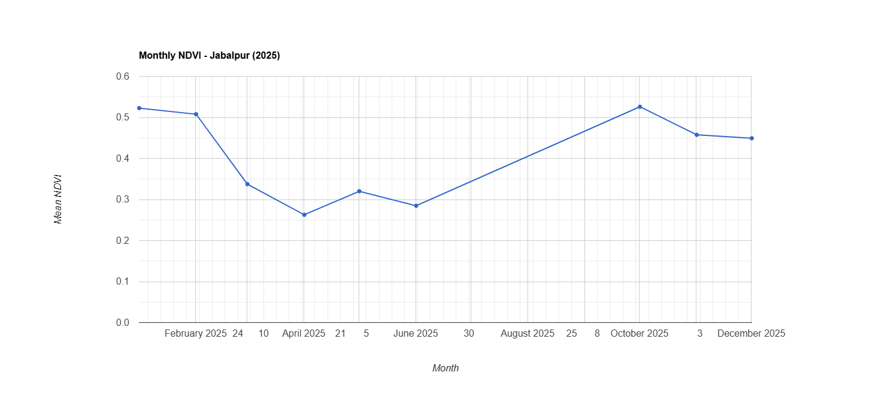
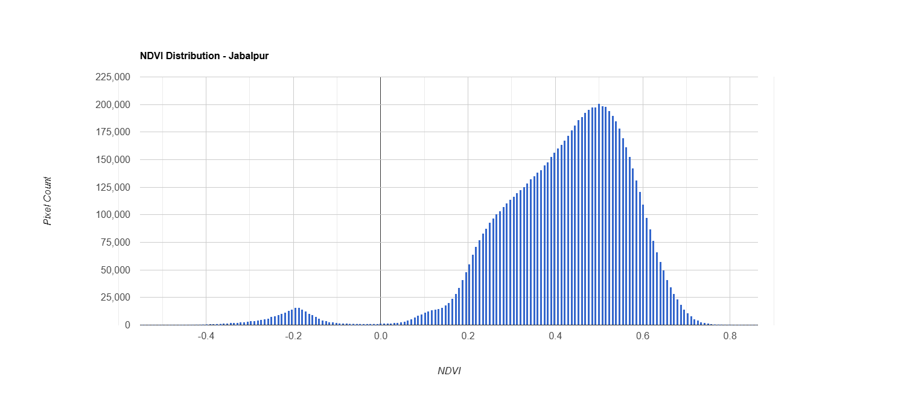

# NDVI

# Jabalpur Vegetation Monitoring using Google Earth Engine

## Overview

This project analyzes vegetation conditions in Jabalpur, Madhya Pradesh,
India using Sentinel-2 satellite imagery and Google Earth Engine.

The project uses the Normalized Difference Vegetation Index (NDVI) to
visualize vegetation conditions and examine monthly variation during 2025.

## Study Area

The study area is Jabalpur, Madhya Pradesh, India.

The region was defined as a Region of Interest (ROI) in Google Earth Engine.

## Data

- Satellite: Sentinel-2
- Dataset: Sentinel-2 SR Harmonized
- Year analyzed: 2025
- Platform: Google Earth Engine
- Spatial resolution: 10 m for Sentinel-2 red and near-infrared bands

## Methodology

The workflow consists of:

1. Define the Jabalpur region of interest.
2. Load Sentinel-2 SR Harmonized imagery.
3. Filter imagery by location and date.
4. Apply a cloud-percentage filter.
5. Create a median image composite.
6. Calculate NDVI.
7. Calculate NDVI statistics.
8. Generate monthly NDVI composites.
9. Create a monthly NDVI time-series chart.

### NDVI Formula

NDVI is calculated as:

NDVI = (NIR - Red) / (NIR + Red)

For Sentinel-2:

- NIR = B8
- Red = B4

## Results

The 2025 analysis used 94 Sentinel-2 scenes.

| Metric | Value |
|---|---:|
| Sentinel-2 scenes | 94 |
| Mean NDVI | 0.4166 |
| Minimum NDVI | -0.5833 |
| Maximum NDVI | 0.8711 |
| Monthly composites | 9 |

The monthly NDVI values showed noticeable fluctuation during 2025,
indicating seasonal variation in vegetation conditions.

## Visualizations

### Monthly NDVI Time Series

### NDVI Distribution

## Tools and Technologies

- Google Earth Engine
- JavaScript
- Sentinel-2
- Remote Sensing
- GIS
- NDVI
- Time-series analysis

## Key Learning Outcomes

Through this project I learned how to:

- Define and work with a study area in Google Earth Engine.
- Work with Sentinel-2 ImageCollections.
- Filter satellite imagery by date, location and cloud percentage.
- Create image composites.
- Calculate NDVI.
- Calculate regional statistics.
- Create monthly satellite-image composites.
- Visualize remote-sensing time series.
- Organize a Google Earth Engine project for a GIS portfolio.

## Priyanka
